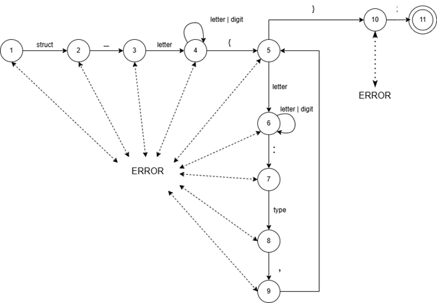
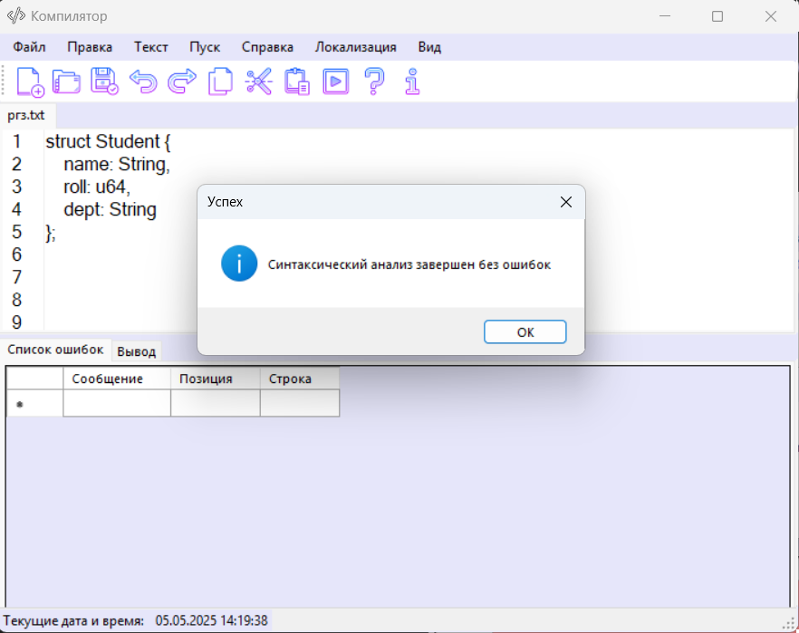
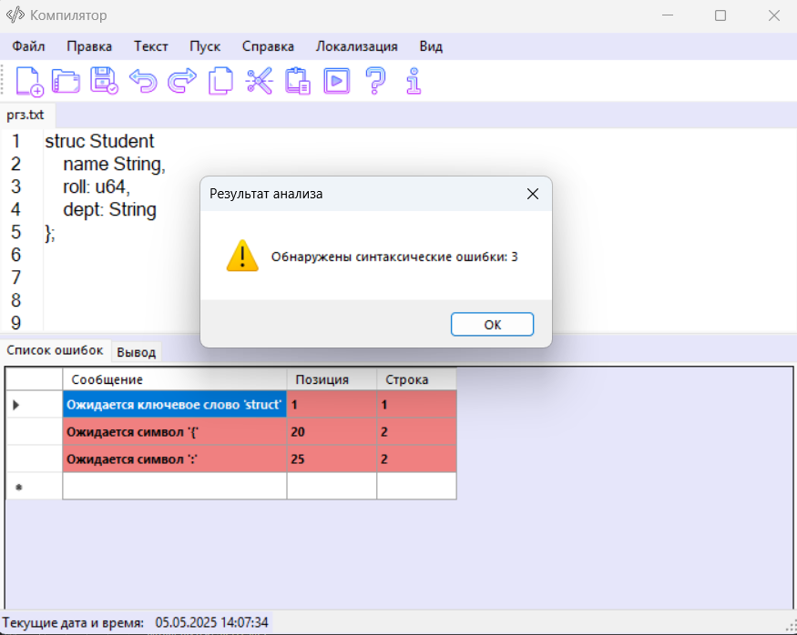

# Анализатор структур на языке Rust

## Вариант 8: Объявление и определение структуры

struct Student {
    name: String,
    roll: u64,
    dept: String,
};

## Примеры допустимых структур

### 1. Структура с полями базовых типов

struct Student {
    name: String,
    roll: u64,
    dept: String,
};

### 2. Структура с числовыми полями

struct Point {
    x: i32,
    y: i32,
};


## Разработанная грамматика

```
1. <Def>       → "struct " <STRUCT>
2. <STRUCT>    → " " <Name> 
3. <Name>      → <Letter> <NameRem>
4. <NameRem>   → <Letter> <NameRem>
               | <Digit> <NameRem>
               | "{" <x>
5. <x>         → <Letter> <XRem>
6. <XRem>      → <Letter> <XRem>
               | <Digit> <XRem>
               | ":" <y> 
7. <y>         → <Type> <Field> 
8. <Field>     → "," <x>
               | "}" <End> 
9. <End>       → ";" 
10. <Type>      → "String" | "u64" | "i32" | "f64" | "bool"
11. <Letter>    → [a-zA-Z]
12. <Digit>     → [0-9]
```

## Классификация грамматики

Согласно классификации Хомского, данная грамматика:

- Тип 3 (регулярная/автоматная)
- Все продукции праворекурсивные (A → aB | a | ε)

## Граф конечного автомата



## Тестовые примеры

### Корректный ввод



### Ошибочный ввод



## Использование

1. Введите код структуры в редактор
2. Нажмите "Анализировать"
3. Просмотрите результаты:
   - Все ошибки будут выделены
   - Подробный отчет о синтаксических ошибках
