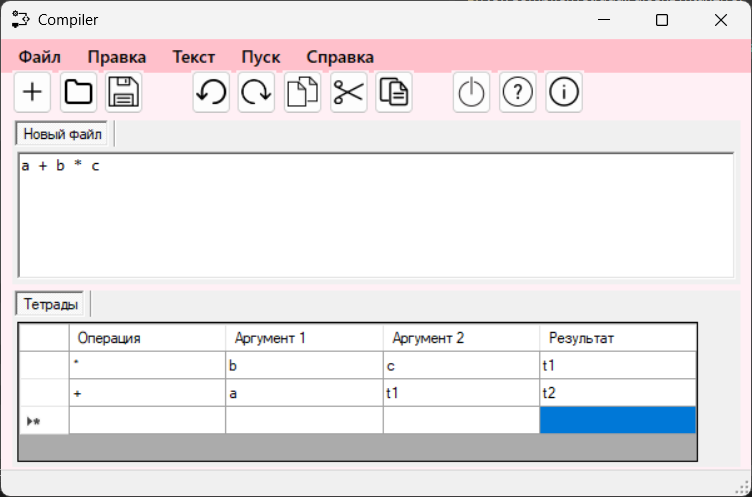
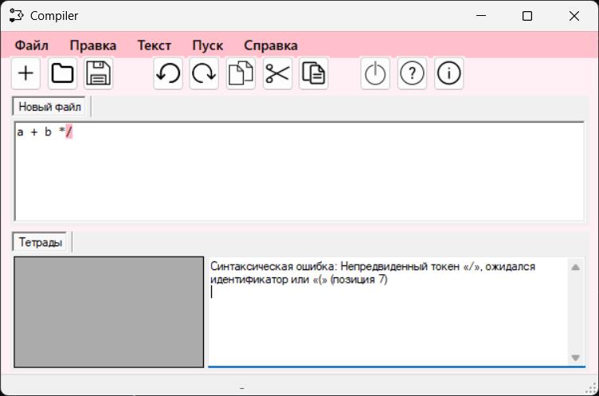

# Лабораторная работа 5: Включение семантики в анализатор. Тетрады

## Цель работы
Дополнение анализатора этапом формирования внутреннего представления программы в виде тетрад.

## Теоретическая часть
Тетрада - структура данных компилятора вида:
```
op | arg1 | arg2 | result
```
где:
- `op` - операция
- `arg1`, `arg2` - аргументы
- `result` - временный результат

## Грамматика G[<E>]
```bnf
1. E → TA 
2. A → ε | + TA | - TA 
3. T → ОВ 
4. В → ε | *ОВ | /ОВ 
5. О → id | (E) 
6. id → letter {letter}
```

## Реализация

### Класс тетрады
```csharp
public class Quad
{
    public string Op { get; }
    public string Arg1 { get; }
    public string Arg2 { get; }
    public string Result { get; }

    public Quad(string op, string a1, string a2, string res)
    {
        Op = op;
        Arg1 = a1;
        Arg2 = a2;
        Result = res;
    }
}
```

### Пример генерации тетрад
Для выражения `a + b * c`:
```csharp
var quads = new List<Quad>
{
    new Quad("*", "b", "c", "t1"),
    new Quad("+", "a", "t1", "t2")
};
```

## Тестирование программы

### Пример 1: Корректное выражение


**Вывод тетрад:**
|   | Опер | Арг1 | Арг2 | Результ |
|---|-------|------|------|---------|
| ► | *     | b    | c    | t1      |
|   | +     | a    | t1   | t2      |

### Пример 2: Ошибочное выражение


**Обнаружены ошибки:**
1. Строка 1: Ожидался идентификатор, найдено '3'
2. Строка 1: Неправильная закрывающая скобка

## Инструкция по использованию
1. Введите выражение в текстовый редактор
2. Нажмите кнопку "Анализировать"
3. Просмотрите результаты:
   - Таблицу тетрад (при успешном анализе)
   - Список ошибок (при наличии)

## Классификация тетрад
Типы операций:
- Арифметические: `+`, `-`, `*`, `/`
- Присваивание: `=`
- Специальные: 
  - `►` - начало цепочки
  - `●` - завершение

## Вывод
Реализован анализатор выражений с:
1. Лексическим анализом
2. Синтаксическим анализом (рекурсивный спуск)
3. Генерацией тетрад как внутреннего представления
